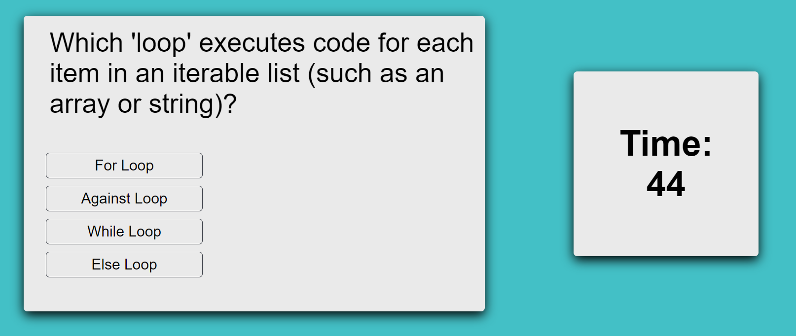

# Timed Coding Assessment (HTML, CSS, JavaScript)

## Description

Another web-app based test? Why?

The core motivation behind building this was to put more reps in with JavaScript, and specifically to practice creating, modifying, and removing elements from the DOM. I also welcomed another opportunity to practice styling a page that I had built from scratch in CSS.

With regards to learning JavaScript, I took away a great deal from this assignment. Among these was using forEach to iterate on a collection of nodes, and sorting objects within an array using ternary operators, neither of which I had attempted previously.

## Usage

Navigate to the deployed page [here](https://valjean451.github.io/distilled-anxiety/).

## Credits

I used many instructional resources to bridge the knowledge gaps. Chief among them was a YouTube tutorial on a similar project, which I utilized to better understand how to switch between questions.
[MCQ Text Tutorial](https://www.youtube.com/watch?v=49pYIMygIcU)

As well as many other guides and walkthroughs of various methods, styles, etc. Most notable are these:
[W3 Schools - Button Styling](https://www.w3schools.com/css/css3_buttons.asp)
[W3 Schools - HTML Forms](https://www.w3schools.com/html/html_forms.asp)
[StackOverflow - Local Storage](https://stackoverflow.com/questions/7679955/how-to-append-to-html5-localstorage)

## License

Please refer to the license in the repo. 
